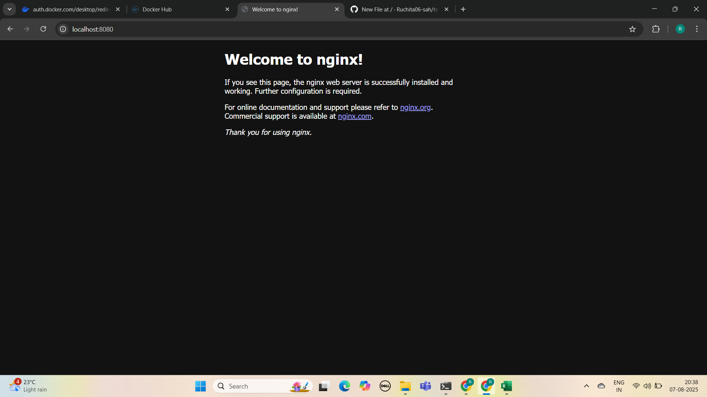

# Infrastructure as Code (IaC) with Terraform

## Objective
Provision a local Docker container using Terraform to understand the basics of Infrastructure as Code (IaC).

## Tools Used
- **Terraform**
- **Docker**

## Files Included
- `main.tf` – Terraform configuration to create a Docker container
- `terraform.lock.hcl` – Dependency lock file for Terraform providers
- `.gitignore` – Ignores Terraform state files and folders
- `init_output.txt` – Output of `terraform init`
- `plan_output.txt` – Output of `terraform plan`
- `apply_output.txt` – Output of `terraform apply`
- `destroy_output.txt` – Output of `terraform destroy`

## Steps Performed

1. **Created Terraform Configuration:**
   - Used the Docker provider
   - Pulled the `nginx:latest` image
   - Created a container named `nginx-container`
   - Exposed port `8080` on localhost

2. **Terraform Commands Executed:**
   - `terraform init` – Initialized the working directory
   - `terraform plan` – Previewed the resources to be created
   - `terraform apply` – Created the Docker container
   - Visited `http://localhost:8080` to verify Nginx was running
   - `terraform destroy` – Cleaned up the resources

## Verification
After `terraform apply`, the Nginx welcome page was accessible at: http://localhost:8080

## Screenshot

Here is a screenshot of the Nginx welcome page running on localhost:

